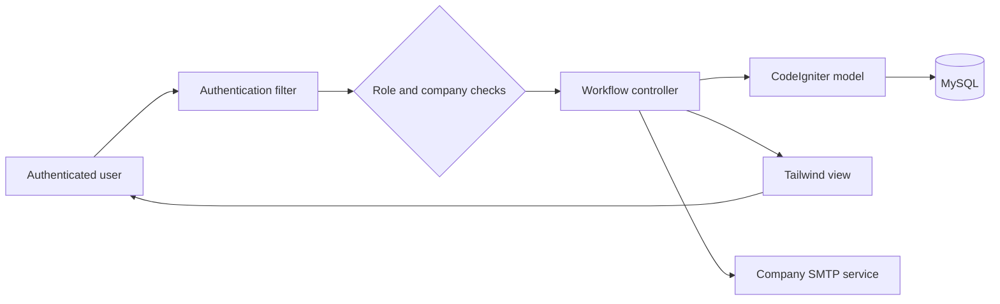

# GICHRMS

> A role-aware human resource and recruitment platform built with CodeIgniter 4, MySQL, PHP, and Tailwind CSS.

[](https://www.php.net/)
[](https://codeigniter.com/)
[](https://www.mysql.com/)

GICHRMS centralizes employee administration, recruitment, attendance, performance reviews, internal communication, and company settings. The recruitment module follows a complete requisition-to-hire workflow with approval gates, document verification, offer acceptance, and pre-onboarding.

## Project status

| Area | Status | Notes |
| --- | --- | --- |
| Authentication and staff | Operational | Company-scoped accounts, roles, profiles, and credential management |
| Recruitment phases 1-4 | Operational | Requisition, sourcing, evaluation, offers, hiring, and pre-onboarding |
| Attendance | Operational | Punching, breaks, calculations, filters, pagination, and CSV export |
| Performance reviews | Operational | HR/admin-only, employee-backed, transactional review workflow |
| Company email | Operational | Encrypted SMTP settings, test delivery, and recruitment notifications |
| Automated checks | Available | PHPUnit unit checks and database-backed workflow verification |

The primary application is located in [`gichrms`](gichrms/). Start there for installation and local development.

## Contents

- [Highlights](#highlights)
- [How the platform works](#how-the-platform-works)
- [Recruitment workflow](#recruitment-workflow)
- [Other modules](#other-modules)
- [Roles and permissions](#roles-and-permissions)
- [Application architecture](#application-architecture)
- [Data model](#data-model)
- [Technology](#technology)
- [Installation](#installation)
- [Using the application](#using-the-application)
- [Useful commands](#useful-commands)
- [Testing notes](#testing-notes)
- [Security considerations](#security-considerations)
- [Known scope and limitations](#known-scope-and-limitations)
- [Contribution workflow](#contribution-workflow)

## Highlights

- Multi-company data isolation for staff and recruitment records
- Role-based access for admins, HR, department heads, hiring managers, and employees
- Four-phase recruitment workflow from requisition through onboarding
- Public `/careers` portal for external candidates, with job search and account-free applications
- Resume and onboarding-document storage with guarded access
- Company-specific SMTP configuration and recruitment notifications
- Live attendance punching, breaks, calculations, filters, and CSV export
- Transactional performance-review submissions restricted to HR and admins
- Responsive Tailwind CSS interface

## How the platform works

The HRMS uses authenticated sessions, company ownership, and role checks to decide what each user can see and change. A typical request passes through the authentication filter, a workflow controller, a company-scoped model query, and then a responsive server-rendered view.



The application uses conventional CodeIgniter server rendering. JavaScript enhances interactive controls, but authorization and workflow validation remain on the server.

## Recruitment workflow

| Phase | Workflow | Main capabilities |
| --- | --- | --- |
| 1 | Requisition & approval | Draft or submit a requisition, HOD review, HR approval, company-scoped job publication |
| 2 | Sourcing & applications | Internal/external publishing controls, employee career portal, application form, resume repository |
| 3 | Evaluation & interviews | Screening, shortlisting, interview scheduling, bounded scoring, selection and rejection emails |
| 4 | Offer & onboarding | Salary package, BGV/experience documents, verification, offer letter, electronic acceptance, hiring and pre-onboarding |

State-changing actions are validated server-side. Terminal applications cannot be replayed into earlier stages, accepted offers cannot be reissued, and employee conversion occurs in a database transaction.

### Recruitment state progression

```text
Draft -> Pending Approval -> HOD Approved -> HR Approved / Published
      -> Applied -> Shortlisted -> Interview Scheduled
      -> Selected -> Documents Requested -> Documents Submitted
      -> Verified -> Offer Sent -> Offer Accepted -> Hired -> Pre-Onboarding
```

At the screening, evaluation, document-verification, and offer-response stages, rejection or failure closes the applicable branch. Direct endpoint calls cannot skip the required earlier state.

### Recruitment responsibilities

1. A hiring manager or administrator prepares and submits a requisition.
2. A department head approves or rejects the request.
3. HR approves the posting and chooses internal or external publication.
4. An employee candidate submits an application and resume.
   External candidates can instead browse `/careers` and apply without creating an employee account.
5. HR screens, schedules, evaluates, selects, or rejects the candidate.
6. HR records the package and requests verification documents.
7. The candidate uploads BGV and experience files.
8. HR verifies the documents and issues a printable offer letter.
9. The candidate accepts with an electronic signature or provides a decline reason.
10. HR converts an accepted candidate to an employee and starts pre-onboarding.

## Other modules

### Employee management

- Company staff directory
- Role, department, position, employment type, and joining details
- Controlled login-credential creation, reset, and removal
- Active/inactive account enforcement

### Attendance

- Daily punch-in and punch-out
- Break start/end tracking
- Late-arrival, worked-time, and overtime calculations
- Monthly summaries, status/date filters, pagination, and CSV export
- One attendance record per employee per day

### Performance reviews

- HR/admin-only access
- Company employee selector backed by staff records
- Professional and personal excellence assessments
- Goals, initiatives, training requirements, comments, scores, and signatures
- Atomic multi-table persistence with employee, company, and reviewer ownership

### Communication and settings

- Authenticated employee chat
- User profile settings
- Encrypted, company-specific SMTP settings
- Test email and candidate notification support

### Authentication experience

- Responsive company-branded sign-in screen
- Preserved email input and accessible error feedback
- Password visibility control and browser autocomplete support
- Disabled-account and disabled-login enforcement on every authenticated request
- Public registration creates an employee-level account in the active default company

### Scaffolded screens

The repository also contains dashboard, subscription, invoice, package, support-ticket, payroll, and report-oriented views inherited from the broader ERP interface. These screens should be treated as UI scaffolding unless backed by a controller, model, migration, and tested workflow in the active application.

## Roles and permissions

| Role | Typical access |
| --- | --- |
| `admin` | Company administration, staff, recruitment, evaluations, offers, performance reviews, email settings |
| `hr` | Staff management, final requisition approval, recruitment operations, offers, onboarding, performance reviews |
| `department_head` | Department-level requisition approval or rejection |
| `hiring_manager` | Create and manage owned requisitions |
| `employee` | Career opportunities, applications, personal offers, attendance, chat, and profile |

Controller-level checks enforce sensitive permissions even when a route is called directly.

## Application architecture

| Layer | Location | Responsibility |
| --- | --- | --- |
| Routes | `gichrms/app/Config/Routes.php` | Maps HTTP methods and URLs to controllers; attaches authentication filters |
| Filters | `gichrms/app/Filters/` | Rejects unauthenticated, inactive, or login-disabled sessions |
| Controllers | `gichrms/app/Controllers/` | Validates roles, workflow state, input, files, and redirects |
| Models | `gichrms/app/Models/` | Encapsulates company-scoped database access and allowed fields |
| Libraries | `gichrms/app/Libraries/` | Provides encrypted company SMTP delivery |
| Views | `gichrms/app/Views/` | Renders responsive PHP/Tailwind pages and email templates |
| Migrations | `gichrms/app/Database/Migrations/` | Creates and evolves the application schema |
| Public storage | `gichrms/public/uploads/` | Stores randomized resume files accessed through guarded routes |
| Private storage | `gichrms/writable/uploads/` | Stores verification documents outside the public web root |

### Design decisions

- **Server-enforced authorization:** hiding a navigation item is not considered access control; controllers recheck the role and company.
- **Tenant-aware queries:** staff, requisitions, applications, offers, email settings, attendance, and reviews are associated with a company.
- **Explicit workflow states:** recruitment actions verify the current state before writing the next state.
- **Transactional writes:** candidate conversion and performance-review persistence avoid partially saved multi-table operations.
- **Private onboarding files:** verification documents are downloaded through authorized controller actions instead of direct public paths.

## Data model

The most important tables are grouped below. Additional performance-review detail tables store the individual assessment sections.

| Domain | Tables | Purpose |
| --- | --- | --- |
| Identity | `companies`, `users`, `departments` | Company ownership, employees, roles, credentials, and organization structure |
| Recruitment | `job_requisitions`, `job_applications` | Requisition approval, postings, applications, interviews, offers, and onboarding state |
| Attendance | `attendance_records` | One daily shift per company employee, including punches and breaks |
| Communication | `chat_messages`, `company_email_settings` | Employee conversations and encrypted SMTP configuration |
| Performance | `performance_reviews`, `professional_excellence`, `personal_excellence`, `special_initiatives`, `comments_on_role`, `personal_goals`, `review_comments`, `hrd_scores`, `signatures` | Review ownership, assessment sections, comments, goals, scores, and sign-off |

Migrations are the source of truth for schema changes. Apply them in timestamp order with `php spark migrate`; do not create production tables manually.

## Technology

- PHP 8.2+
- CodeIgniter 4.7
- MySQL with the `MySQLi` PHP extension
- Tailwind CSS
- Lucide icons
- PHPUnit 10
- Composer

## Repository layout

```text
GICHRMS/
|-- gichrms/                  # Active HRMS application
|   |-- app/
|   |   |-- Config/           # Routes and framework configuration
|   |   |-- Controllers/      # HTTP and workflow controllers
|   |   |-- Database/         # Migrations and seeds
|   |   |-- Libraries/        # Company email service
|   |   |-- Models/           # Database models
|   |   `-- Views/            # Tailwind-based interfaces and emails
|   |-- public/               # Web root and public uploads
|   |-- tests/                # PHPUnit tests
|   `-- writable/             # Logs, sessions, cache, private uploads
`-- README.md
```

## Requirements

- PHP 8.2 or later
- Composer 2
- MySQL 8 or a compatible MySQL/MariaDB server
- PHP extensions: `intl`, `mbstring`, `mysqli`, `json`, `curl`, and `fileinfo`

For the complete PHPUnit starter suite, enable `sqlite3`; application unit tests can run without it.

## Installation

### 1. Clone the repository

```bash
git clone https://github.com/RaghavKedia05/GICHRMS.git
cd GICHRMS/gichrms
```

### 2. Install dependencies

```bash
composer install
```

### 3. Create the environment file

CodeIgniter applications normally ship with an `env` template. If one is available, copy it to `.env`; otherwise create `.env` locally. Never commit real credentials or encryption keys.

```dotenv
CI_ENVIRONMENT = development

app.baseURL = 'http://127.0.0.1:8080/'

database.default.hostname = localhost
database.default.database = hrms
database.default.username = root
database.default.password =
database.default.DBDriver = MySQLi
database.default.port = 3306
```

### 4. Create the database

```sql
CREATE DATABASE hrms CHARACTER SET utf8mb4 COLLATE utf8mb4_general_ci;
```

### 5. Generate an encryption key

The encryption key protects saved company SMTP passwords.

```bash
php spark key:generate
```

### 6. Run migrations

```bash
php spark migrate
php spark migrate:status
```

### 7. Start the development server

```bash
php spark serve --host 127.0.0.1 --port 8080
```

Open [http://127.0.0.1:8080](http://127.0.0.1:8080). For Apache or Nginx, point the document root to `gichrms/public`, not the application directory.

## First-time configuration

1. Register or create the initial user.
2. Assign the appropriate role and company in the database or through an existing admin account.
3. Add departments and staff members.
4. Open **Settings > Company Email** to configure SMTP.
5. Send a test email before using candidate notifications.

Use an SMTP app password or provider-specific credential instead of a personal account password.

## Using the application

### Administrator or HR setup

1. Sign in with an admin or HR account.
2. Create departments and add staff from the staff directory.
3. Assign each staff member the correct role and department.
4. Enable login credentials only for users who need application access.
5. Configure and test company SMTP settings.
6. Confirm the application base URL before sending candidate emails, because notification links use this value.

### Start a recruitment cycle

1. Open **Recruitment > Job Requisitions** and create a requisition.
2. Submit it for HOD and HR approval.
3. Publish the approved role internally, externally, or through both channels.
4. Track applications in the candidates and evaluation views.
5. Open the selected candidate in **Offers & Onboarding** to continue phase 4.

### Record attendance

1. Open **My Workspace > Attendance**.
2. Punch in once for the working day.
3. Start and end breaks as required.
4. End an active break before punching out.
5. Filter historical records or export the selected date range as CSV.

Attendance calculates late status using the configured application logic, deducts recorded breaks from worked time, and counts work beyond eight hours as overtime.

### Submit a performance review

1. Sign in as HR or admin.
2. Open **Performance Reviews** and choose an active company employee.
3. Complete the professional, personal, goals, comments, scoring, and signature sections.
4. Submit the form once all required review information is ready.

The server reloads employee identity from the staff record, so altered name, employee ID, position, or company values are not trusted from the browser.

## Useful commands

```bash
# Show registered routes
php spark routes

# Apply pending migrations
php spark migrate

# Inspect migration state
php spark migrate:status

# Clear framework caches
php spark cache:clear

# Run tests
composer test

# Run the non-database unit tests
vendor/bin/phpunit tests/unit
```

On Windows PowerShell, use `vendor\bin\phpunit` for the PHPUnit executable.

## Upload storage

| Content | Location | Access |
| --- | --- | --- |
| Candidate resumes | `public/uploads/resumes/` | Served only through guarded application routes |
| Onboarding documents | `writable/uploads/onboarding/` | Private storage; owner or authorized HR/admin only |

Uploaded names are randomized. Resume, BGV, and experience-document actions validate workflow ownership and company access.

## Testing notes

The application has been exercised through database-backed HTTP workflows covering:

- Requisition approval and publication permissions
- Duplicate applications and invalid interview transitions
- Selection, rejection, and terminal-state replay protection
- Document validation, verification, offer acceptance, and employee conversion
- Attendance punching, breaks, duplicate prevention, filters, and export
- Performance-review role restrictions, identity tampering, and transactional saving

The default starter database tests use SQLite and require the PHP `sqlite3` extension. A missing coverage driver may produce a PHPUnit warning without indicating an application failure.

## Security considerations

- Keep `.env`, SMTP passwords, and encryption keys out of version control.
- Use HTTPS in production.
- Point the web server only at the `public/` directory.
- Keep `writable/uploads/onboarding/` outside the public web root.
- Use least-privilege database credentials.
- Disable development mode and the debug toolbar in production.
- Back up the database and private uploads together.

## Known scope and limitations

- The active, maintained application is `gichrms`.
- Several broad ERP/report pages are presentation scaffolds and are not described as operational modules here.
- External job-board publication is represented by posting configuration; direct third-party job-board API integrations are not included.
- Offer acceptance uses a consent-backed typed electronic signature and audit metadata. It is not a DocuSign integration.
- Candidate email delivery depends on valid company SMTP settings and a correct `app.baseURL`.
- Attendance currently records one shift per employee per day and uses application-server time.
- The starter PHPUnit database examples require the PHP `sqlite3` extension.
- Tailwind CSS, Lucide icons, and Google Fonts are loaded from CDNs in the current views; production deployments may choose to bundle these assets locally.

## Contribution workflow

1. Create a focused branch for the change.
2. Add a migration for every schema modification.
3. Keep company and role checks in server-side controller/model logic.
4. Run PHP syntax checks and the relevant workflow tests.
5. Run `git diff --check` before opening a pull request.
6. Document new environment variables, routes, storage paths, and user-visible behavior.

Do not commit `.env`, generated session files, logs, uploaded candidate documents, or production database exports.

## Current scope

`gichrms` is the active application documented here.
